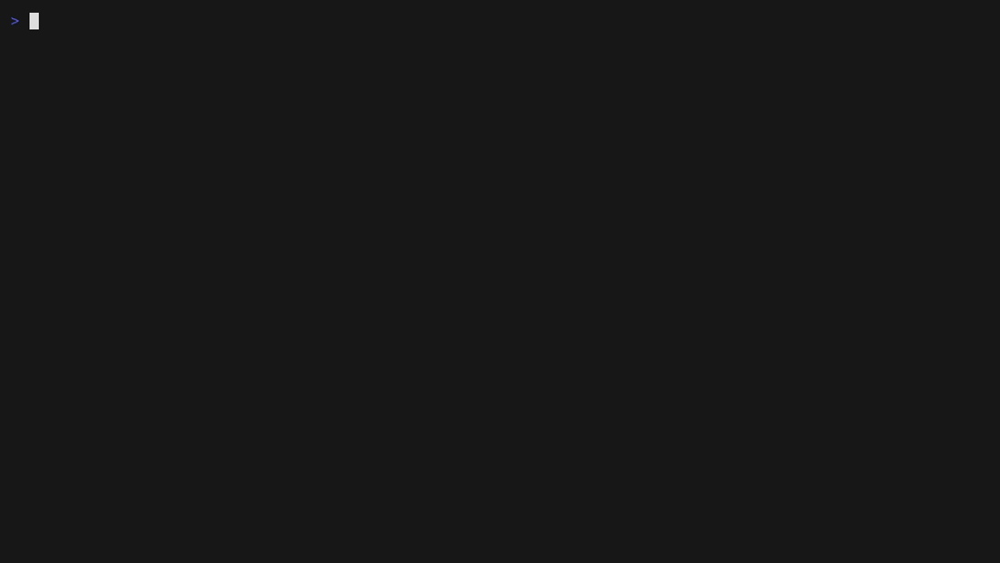

<div align="center">

# memeval

Measure an agent memory layer before you trust it. Rank and adversarial evals over pluggable adapters, with every run recorded for replay, charts, and A/B comparison.



</div>

---

memeval drives any memory store that can retain text and recall it by query — Hindsight, mem0, Letta, Zep, or your own service behind a ~40-line adapter — and reports where the right facts land, how fast, and whether the store invents facts nobody told it. The core needs nothing beyond the Python standard library; the replay TUI and chart output are optional extras.

## What it checks

**Rank.** Load a corpus of facts, run gold queries, record where the correct fact lands in the results. Real output from a live Hindsight instance on the bundled 125-doc corpus:

```
rank eval [hindsight]
  hit@1 ▇▇▇▇▇▇▇▇ 117/119
  hit@3 ▇▇▇▇▇▇▇▇ 119/119
  hit@k ▇▇▇▇▇▇▇▇ 119/119  (k=10)
  MRR 0.992   p50 286ms   p95 468ms   errors 0
```

That's 119 paraphrased queries, and the two rank-1 misses are the dataset doing its job: a near-miss distractor (the circuit-breaker config fact) outranked the incident that created it, and one stale-pair query surfaced the superseded fact above the current one. `--repeat N` reruns the queries against one retain and shows the spread, since vector recall is not always deterministic.

**Adversarial.** Retain a small set of facts chosen to invite a bad merge, trigger the store's consolidation, and check whether recall now returns a statement no source made. Then feed corrections and check whether the fabrication goes away. A store that invents a fact and won't retract it is worse than one that misses. A check that errors is reported as an error, never as "clean".

**Silent write loss.** After retain, memeval polls until the stored docs are actually recallable, instead of trusting the write acknowledgment. This caught a real case during this repo's own release verification — the store returned success and the fact never became findable:

```
WARNING: 1 doc(s) never became recallable (silent write loss?): nw-06
```

Rank scores can come out perfect while a store quietly drops writes. This check is why that doesn't slip past.

## Install

    git clone https://github.com/nuk3s/memeval
    cd memeval
    pip install -e .            # core: stdlib only
    pip install -e .[tui]       # + replay TUI (Textual)
    pip install -e .[charts]    # + SVG/PNG charts (matplotlib)
    pip install -e .[all]

Python 3.10 or newer.

## Use it

The bundled dataset is meant to be a meaningful first eval, not a smoke test: 125 facts
about a fictional ops platform with built-in near-miss distractors (fourteen services on
distinct ports, competing versions and dates) and six stale-fact pairs where only the
current value counts. You can get a real read on a store before writing a corpus of your
own; design notes in [examples/README.md](examples/README.md).

Point an adapter at a throwaway namespace — the rank eval writes the whole corpus into it.

    export HINDSIGHT_URL=https://your-hindsight-host
    export HINDSIGHT_TOKEN=your-token
    export HINDSIGHT_BANK=memeval-scratch

    memeval doctor --adapter hindsight     # prove the adapter works first
    memeval rank --adapter hindsight --corpus examples/corpus.jsonl --gold examples/gold.jsonl
    memeval adversarial --adapter hindsight --probe examples/adversarial.json
    memeval ab --a hindsight --b mem0 --corpus examples/corpus.jsonl --gold examples/gold.jsonl

## Recorded runs

Every run appends its events to `runs/<timestamp>_<adapter>_<kind>.jsonl` — the queries, the hits that came back, latencies, verdicts, and errors. Three consumers read that one artifact:

    memeval runs                            # list recorded runs
    memeval replay runs/<file>.jsonl        # step through a run in a TUI
    memeval chart runs/<file>.jsonl         # SVG chart artifact
    memeval chart --ab runA.jsonl runB.jsonl

The format is documented in [docs/run-log.md](docs/run-log.md).

## Adapters

| adapter | status | notes |
|---|---|---|
| `hindsight` | tested | self-hosted Hindsight; verified against a live instance |
| `mem0` | tested | self-hosted mem0 OSS REST server; verified against a live instance |
| `letta` | template | written to the documented V1 archival-memory API; not verified live |
| `zep` | template | Zep Community Edition session/fact API; not verified live — see the docstring for CE caveats (no graph API, search returns extracted facts, CE deprecated upstream) |
| `example-rest` | template | the copy-me starting point for any bearer-token REST memory API |

"Tested" means I ran doctor, rank, and adversarial against a live instance of that system.
"Template" means the code matches the vendor's documented API but nobody has pointed it at
a live server yet — run `memeval doctor --adapter <name>` against yours before trusting
numbers from it, and send a fix if the docs lied.

Writing an adapter is ~40 lines: subclass `MemoryAdapter` from
`memeval/adapters/base.py`, implement `retain(items)` and `recall(query, k)`, optionally
`consolidate()`, `supersede()`, `prepare()`, and `config()`, then register it in
`memeval/adapters/__init__.py`. Copy `example_rest.py` and start from there.
`memeval doctor` is the conformance check: it writes three sentinel docs, polls the recall
roundtrip, and probes the optional capabilities. Partial visibility is an exit-1 PARTIAL,
not a pass.

## Why

I wrote the first version while choosing a shared memory store for several agents on my
own hardware. Recall quality came out a tie between the systems I compared. What decided
it was latency, whether a store would fabricate a fact under its own consolidation, and —
found later, the hard way — whether writes it acknowledged were ever recallable at all.
Public benchmarks measure quality on someone else's corpus; none of them would have caught
the failures that bit me. So the checks here are the ones I needed, they run on your
corpus, and every run leaves a log you can replay when someone asks how you picked.

## Notes

The gold `answer` field is a regex, so one query can accept several correct forms
(`"PostgreSQL 16|db-main"`). A malformed pattern becomes an error row, not a crashed run.

Readiness matching is word overlap, not verbatim: stores that run extraction (Hindsight,
mem0 with inference on) rewrite text at retain time, so an exact-substring check would
report false write loss.

The adversarial result depends on the extractor and the consolidator, so it varies by
model and by system. A clean run on the sample probe does not prove a store never
fabricates; a dirty run proves it can. Write probes from facts your own agents actually
store.

The fabrication check counts only affirmative statements. A correction that negates the
same binding restates the claim to deny it, so a bare regex would flag the correction
itself; the check skips recalled text with a negation cue. That is a heuristic — a
fabrication that happens to carry a negation elsewhere in the sentence can slip past it.

## License

MIT. See LICENSE.
